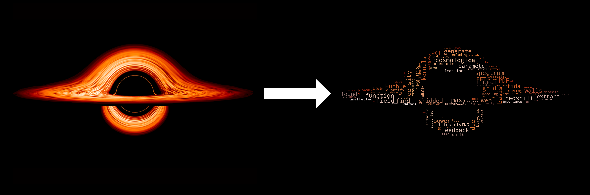

# CloudsOfArx 
[](https://codecov.io/gh/James11222/CloudsOfArx)


An automated webscraper package to make wordcloud images out of the abstracts of your first-author papers. 

## Installation

To use this package just install via pip

`pip install CloudsOfArx`

## Usage

This package is simple and straightforward. To use it simply run the following lines in your python environment of choice after installation via pip.

``` python
import CloudsOfArx

CloudsOfArx.create_wordcloud(ADS_TOKEN, author, image_file, orcid=None, save_name=None)
```

The `ADS_TOKEN` is required to use the NASA ADS API. Make an account on NASA ADS to acquire an API token key, then copy and paste the key as a string for that argument. The `author` argument is the name of the first-author in a "LastName, FirstName" formatted string. `image_file` is a string pointing to the desired image for masking the wordcloud into. I also include the optional `orcid` parameter for authors who wish to use their ORCID to ensure the papers used are their own work. The `save_name` argument is an optional argument for naming the saved wordcloud file.

An example of this is shown below



